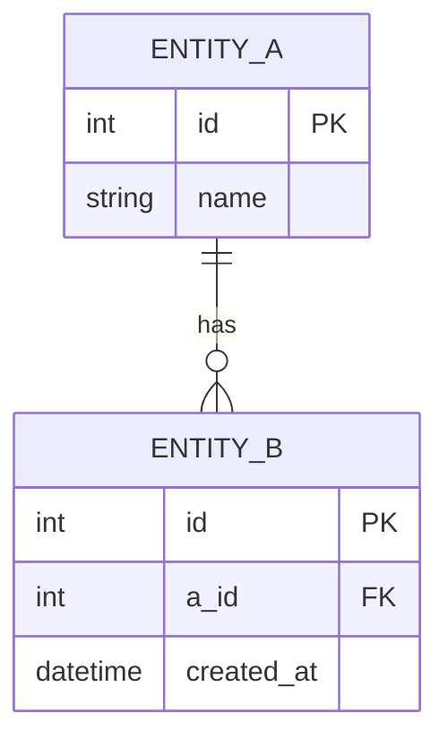

# {文档标题}

> **定位**: {一句话说明这份数据契约定义了什么}
> **状态**: {草稿 / 评审中 / 已生效 / 已废弃}
> **作者**: {作者名}
> **最后更新**: {YYYY-MM-DD}
> **版本**: {v1.0.0}

## 一、概述

{2-3 句话说明数据范围、使用场景、上下游依赖。}

## 二、数据字典

### 2.1 {实体/表/接口名}

{一句话说明该实体的职责。}

| 字段 | 类型 | 必填 | 默认值 | 约束/取值范围 | 说明 |
|------|------|------|--------|---------------|------|
| `{fieldName}` | `{Type}` | Y/N | `{default}` | {min/max/length/regex} | {一句话} |

**示例值**:
```json
{
  "fieldName": "exampleValue"
}
```

### 2.2 {实体/表/接口名}

...

## 三、关系图

{用 ASCII 图或 Mermaid 展示实体之间的关系。}



## 四、约束规则

| 规则编号 | 等级 | 适用范围 | 规则描述 |
|----------|------|----------|----------|
| DR-001 | 强制 | `fieldName` | {具体约束说明} |
| DR-002 | 推荐 | {实体} | {具体约束说明} |

## 五、变更历史

| 版本 | 日期 | 变更内容 | 作者 |
|------|------|----------|------|
| v1.0.0 | {YYYY-MM-DD} | 初始定义 | {作者} |
| v1.1.0 | {YYYY-MM-DD} | 新增 {字段} | {作者} |

---

## 子类型补充结构

### DTO 类文档专用

```markdown
### 序列化规则

| 格式 | 字段命名策略 | null 处理 | 日期格式 |
|------|-------------|-----------|----------|
| JSON | {camelCase/snake_case} | {包含/忽略} | {ISO8601/yyyy-MM-dd} |
| Binary | {LittleEndian/BigEndian} | {N/A} | {N/A} |

### 构建/工厂方法

- `{ClassName}::create()` — {用途}
- `{ClassName}::fromJson(QJsonObject)` — {反序列化入口}
```

### 数据库文档专用

```markdown
### 索引定义

| 索引名 | 字段 | 类型 | 唯一 |
|--------|------|------|------|
| `idx_{table}_{field}` | `{field}` | BTREE | Y/N |

### 外键关系

| 字段 | 引用表 | 引用字段 | 删除行为 | 更新行为 |
|------|--------|----------|----------|----------|
| `{fkField}` | `{refTable}` | `{refField}` | CASCADE/RESTRICT | CASCADE/RESTRICT |
```

### API 接口文档专用

```markdown
### 端点

| 方法 | 路径 | 说明 | 鉴权 |
|------|------|------|------|
| GET | `/api/v1/{resource}` | 列表查询 | {Token/Basic/None} |

### 请求参数

| 参数 | 位置 | 类型 | 必填 | 说明 |
|------|------|------|------|------|
| `{param}` | query/body/path | `{Type}` | Y/N | {说明} |

### 响应

```json
{
  "code": 0,
  "message": "success",
  "data": { ... }
}
```

### 错误码

| 错误码 | HTTP 状态码 | 说明 | 处理建议 |
|--------|-------------|------|----------|
| 10001 | 400 | {错误描述} | {客户端处理建议} |
| 10002 | 401 | {错误描述} | {客户端处理建议} |
```
```

---

## 填写要点

- 数据字典表格是核心——字段名、类型、必填、默认值、约束 5 列缺一不可
- 每张表/每个实体附带示例值（JSON 片段），方便读者快速理解数据结构
- 关系图必须用 Mermaid ER 图或 ASCII 图——文字描述关系不够直观
- 约束规则必须编号（DR-001、DR-002...），便于在代码审查中引用
- 变更历史必须记录——数据契约的版本敏感度远高于其他文档
- JSON 示例值必须与实际代码序列化结果一致，不能是伪代码
- 字段名用反引号包裹，类型用代码字体，区分代码和自然语言
